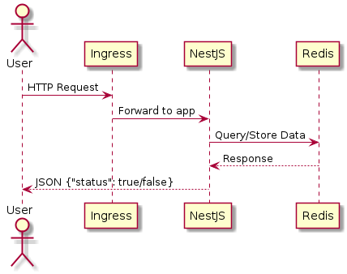
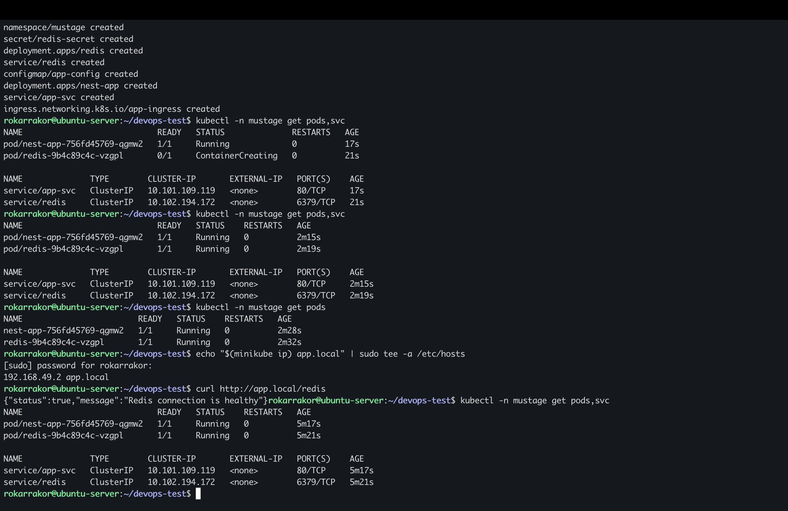

#DevOps Test: NestJS + Redis + Kubernetes

#Опис
Додаток NestJS з одним ендпоінтом `/redis`, який перевіряє підключення до Redis та повертає:
json
{"status": true/false}

#Архітектура

#Запуск локально у Minikube

#1. Збірка Docker-образу
bash
docker build -t devops-test:latest .

#2. Запуск Minikube
bash
minikube start --driver=docker --cpus=2 --memory=2200mb
minikube addons enable ingress

#3. Завантаження образу в Minikube
bash
minikube image load devops-test:latest

#4. Застосування маніфестів
bash
kubectl apply -f k8s/namespace.yaml
kubectl apply -f k8s/redis-secret.yaml -f k8s/redis-deployment.yaml -f k8s/redis-service.yaml
kubectl apply -f k8s/app-config.yaml -f k8s/app-deployment.yaml -f k8s/app-service.yaml
kubectl apply -f k8s/ingress.yaml

#5. Додавання запису в /etc/hosts
bash
echo "$(minikube ip) app.local" | sudo tee -a /etc/hosts

#6. Перевірка
bash
curl http://app.local/redis

#Демонстрація
Скріншоти роботи доступні у (docs/screenshots).

#Пояснення рішення
NestJS і Redis запущені у окремих подах для ізоляції.
Ingress використаний для доступу через домен `app.local`.
Використано багатоступеневий Dockerfile для зменшення розміру образу.

#Скріншоти
- Перевірка ендпойнта `/redis`:
  
  
